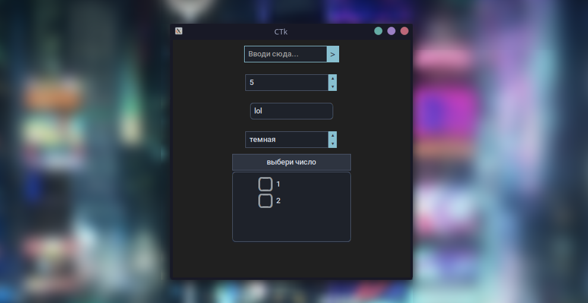

# 📦 CTkPlus

[](https://python.org) &nbsp; [](https://opensource.org) &nbsp; [](https://pypi.org/project/CTkPlus/)

🇺🇸 [Read in English](#english) | 🇷🇺 [Читать на русском](#русский) | 📖 [Wiki Documentation](https://github.com/w1n4a/CTkPlus/wiki)

---

<p align="center">
  
</p>

---

<h2 id="english">English</h2>

**CTkPlus** is a library for CustomTkinter that adds new useful widgets and UI elements, so you don't have to create them manually from scratch.

> ⚠️ **Project is under development:** It is currently in beta testing, so bugs may occur.

### ✨ Features
- **🧩 New components** - adds UI elements that are missing in the standard toolkit.
- **🛠️ Native style** - the look of the elements completely matches standard CustomTkinter widgets.
- **⚡ Simple setup** - the library easily connects to the project and works without complex workarounds.

### 🍱 Available Widgets
<!-- WIDGET_TABLE_START -->
<table width="100%"><thead><tr><th align="left" width="30%">Widget</th><th align="left">Description</th></tr></thead><tbody><tr><td><strong>CTkSpinBox</strong></td><td>Step-by-step number selector with arrow buttons</td></tr><tr><td><strong>CTkSelector</strong></td><td>Convenient widget for selecting options</td></tr><tr><td><strong>CTkMultiList</strong></td><td>Multi-selection list for complex data handling</td></tr><tr><td><strong>CTkEntry</strong></td><td>Upgraded text input with built-in StringVar commands</td></tr><tr><td><strong>CTkEntryButton</strong></td><td>Combined entry field with an attached action button</td></tr><tr><td><strong>lol</strong></td><td>lol</td></tr></tbody></table>
<!-- WIDGET_TABLE_END -->

> 🚀 **More widgets coming soon!** The library is actively expanding. If you have an idea for a cool new widget, feel free to open an Issue or write to me!

### 📥 Installation
Install the library via terminal:
```bash
pip install ctkplus
```

### 🚀 Usage
Short working code to launch a window with a spinbox:
```python
import customtkinter as ctk
import ctkplus as ctp

app = ctk.CTk()
app.geometry("400x300")
app.title("CTkPlus Test")

# Create and place a spinbox
spinbox = ctp.CTkSpinBox(master=app, start_num=5, range=(-10,'inf'), step=5, command=lambda *args: print(spinbox.get()))
spinbox.pack(pady=50, padx=50)

app.mainloop()
```

### 📄 License
This project is licensed under the **MIT** License. You are free to use and modify this code.

---

<h2 id="русский">Русский</h2>

**CTkPlus** - это библиотека для CustomTkinter, которая добавляет новые полезные виджеты и элементы управления, чтобы не создавать их вручную с нуля.

> ⚠️ **Проект находится в разработке:** Сейчас идет этап бета-тестирования, поэтому могут встречаться баги.

### ✨ Возможности (Features)
- **🧩 Новые компоненты** - добавляет элементы интерфейса, которых изначально нет в стандартном наборе.
- **🛠️ Нативный стиль** - внешний вид элементов полностью совпадает со стандартными виджетами CustomTkinter.
- **⚡ Простая настройка** - библиотека легко подключается к проекту и работает без сложных костылей.

> 🚀 **Новые виджеты уже на подходе!** Библиотека активно развивается и пополняется. Есть крутая идея для нового элемента? Смело открывай Issue или пиши мне!

### 📥 Установка (Installation)
Установите библиотеку через терминал:
```bash
pip install ctkplus
```

### 🚀 Пример использования (Usage)
Короткий рабочий код, как запустить окно со спинбоксом:
```python
import customtkinter as ctk
import ctkplus as ctp

app = ctk.CTk()
app.geometry("400x300")
app.title("CTkPlus Тест")

# Создаем и размещаем спинбокс
spinbox = ctp.CTkSpinBox(master=app, start_num=5, range=(-10,'inf'), step=5, command=lambda *args: print(spinbox.get()))
spinbox.pack(pady=50, padx=50)

app.mainloop()
```

### 📄 Лицензия (License)
Проект распространяется под открытой лицензией **MIT**. Вы можете свободно использовать и менять этот код.
